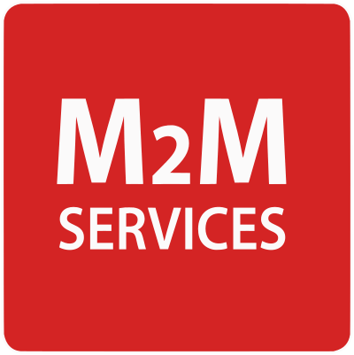

<p align="center"></p>

# homebridge-m2m
### 🚨 M2M Services Alarm System Plugin for Homebridge

`homebridge-m2m` is a plugin for [Homebridge](https://homebridge.io/) that enables security systems accessible from RControl or DSC Connect (iOS/Android apps built on the same M2M Services backend) to be used through HomeKit.

This is a fork of [homebridge-rcontrol](https://github.com/aabosh/homebridge-rcontrol) by Andrew Abosh, renamed after the M2M Services API that RControl runs on.

## Features
- Arm and disarm your security system from the Home app or Siri
- Log in with either your RControl or DSC Connect account credentials
- Optionally expose each alarm zone (doors, windows, motion) as its own HomeKit contact/motion sensor
- Support for accounts with multiple panels or partitions: add multiple platform entries and point each one at a specific panel/partition (see Notes)
- Fast, responsive status updates in the Home app
- Debug logging for troubleshooting
- Built for Homebridge v2 and modern Node.js

## Requirements
- Node.js 22, 24, or 26
- Homebridge 2.0.0 or later

## Configuration
homebridge-m2m is a Homebridge **platform**, configured under `platforms` in `config.json`:

```json
{
  "platforms": [
    {
      "platform": "M2M",
      "name": "Alarm",
      "username": "...",
      "password": "...",
      "enableZoneSensors": false
    }
  ]
}
```

> **Upgrading from an earlier version?** homebridge-m2m used to be a Homebridge **accessory**, configured under `accessories`. Move your existing block from `accessories` to `platforms` and rename its `accessory` field to `platform` (same field values otherwise). This is a one-time breaking change — see Notes for what else it affects.

Set `enableZoneSensors: true` to also register a contact or motion sensor for each zone on the panel, polled for state changes every 10 seconds by default (configurable under Advanced Settings). Zone names and sensor types (contact vs. motion) are auto-discovered from the panel; no per-zone configuration is needed.

Panel IMEI, partition number, and the zone polling interval live under an **Advanced Settings** section in the Config UI, collapsed by default — most users won't need to touch them.

## Notes
- Migrating from the old accessory-based config gives your panel a new HomeKit accessory identity (Homebridge platforms manage their own accessory IDs, separate from the old accessory-plugin ones) — you'll need to re-add it to any HomeKit rooms, scenes, or automations that referenced the old one.
- By default, homebridge-m2m controls the first panel and partition on your account. If you have more than one, set the optional `imei`/`partitionNumber` config fields to pick which one a given platform entry controls. This is untested against a real multi-panel/multi-partition account — please open an issue if it doesn't work as expected.
- Home and Night both arm the panel in the same "stay" mode, since the panel itself doesn't distinguish between them; Away arms separately.
- Switching directly between Away and Home/Night from the Home app briefly disarms the panel before re-arming into the requested mode, since M2M's API doesn't support switching between armed modes directly.
- Due to limited testing and the usage of M2M's undocumented and private API, this is unstable and may cease to work in the future. 

## License
`homebridge-m2m` is licensed under the MIT license.
